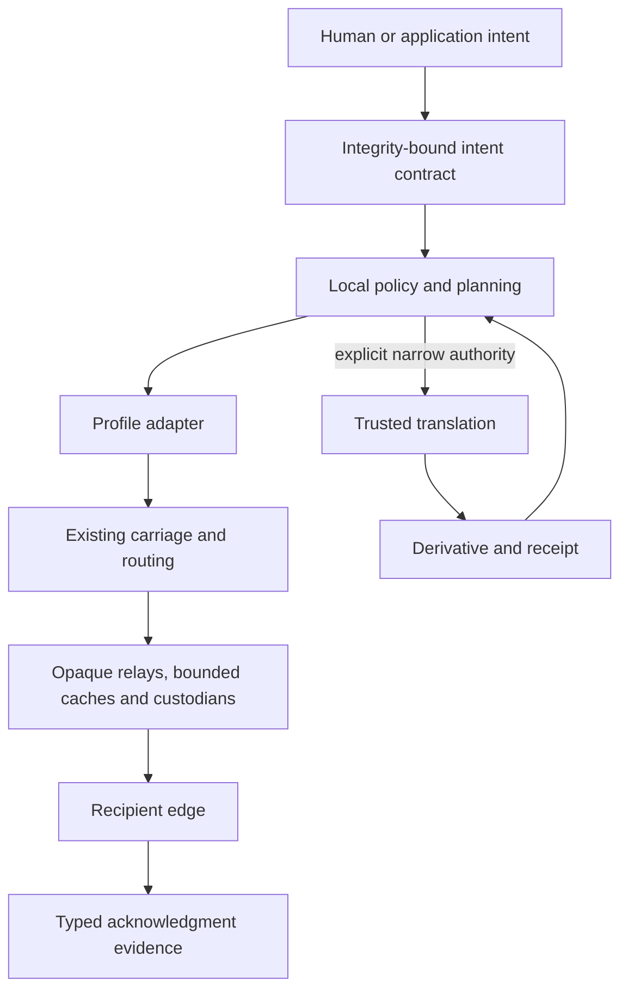

# Architecture

**State:** architecture under design; no conforming implementation exists

Harriet is a connective semantic layer between human intent and independently evolving carriage systems. It is not a universal router, identity provider, translator, or mandatory runtime.

## Ordinary-user requirement

An eventual ordinary user must be able to install or download Harriet, identify who must be reached, and express simple privacy, urgency, acceptable-degradation, and acknowledgment preferences without command-line or networking expertise. Technical profile selection belongs underneath that experience. No conforming interface currently exists.

## Canonical model

1. **Application and experience:** enables an ordinary person to identify who must be reached and express simple privacy, urgency, permitted degradation, and acknowledgment preferences; technical profiles remain underneath and must not require command-line or networking expertise. This layer captures recipient, content, urgency, permitted transformation, minimum useful representation, confidentiality, and required evidence.
2. **Identity and authorization:** keeps human, device, service, and group principals distinct and binds external profile identifiers with explicit scope.
3. **Intent contract and payload manifest:** integrity-protects sender-authorized policy and object digests. Relays cannot rewrite it.
4. **Local planning context:** holds sensitive, expiring capabilities, reachability observations, resource state, path estimates, and trust preferences. It is not globally authoritative.
5. **Representation graph:** records authorized source-to-derivative choices, cost, recipient decodability, provenance, declared loss, and uncertainty.
6. **Delivery orchestration:** manages queues, replicas, custody, attempts, expiration, deadlines, and acknowledgment interpretation within separate budgets.
7. **Profile adapters:** map supported semantics into external protocols and explicitly refuse or declare gaps.
8. **Carriage and routing:** remain owned by existing transport and routing systems at their proper layers.
9. **Resource providers:** expose distinct opaque-relay, cache, custodian, home-relay, and trusted-translator roles.
10. **Hardware and deployment:** expose capabilities and owner budgets; embodiments do not define platform semantics.
11. **Evidence and conformance:** verify policy preservation, refusal, mappings, receipts, custody transitions, abuse bounds, and metadata behavior.

## State and ownership boundaries

The communication exchange uses four distinct record classes:

- an immutable or integrity-bound **intent contract and payload manifest**;
- private, mutable, and probabilistic **local planning context**;
- profile-scoped **forwarding and custody state**;
- append-only **evidence records** for precisely typed events.

The logical envelope is not repeated in every packet. [RFC 0002](docs/rfc/0002-compact-rescue-vertical-slice.md) proposes canonical, compact-initial, cached-reference, and extreme-constrained forms for a falsifiable rescue slice. Compact references resolve only within declared origin, incident, profile, and cryptographic scope; missing or ambiguous state fails closed. See the [communication envelope](docs/architecture/communication-envelope.md) and [distress model](docs/architecture/distress-and-rescue.md).

Available paths, energy, queues, trust estimates, and delivery probability are not signed end-to-end truth. They are source-attributed, expiring local observations. The term “core” refers to the contracts among logical roles, not a central coordinator or monolithic service.

## Translation and delivery

Ordinary relays do not require plaintext. A trusted translator receives explicit authority for one bounded derivation and returns the result and receipt to policy evaluation before profile selection. A receipt proves provenance and declared loss, not subjective semantic fidelity.

Lifetime, hop budget, replica budget, priority, deadline, custody, acknowledgment, payload class, minimum representation, preferred relay, and confidentiality remain independent. Custody acceptance, next-hop transfer, endpoint receipt, representation acceptance, and human acknowledgment are different evidence classes.

## Security and conformance

Reachability and custody metadata are tracking-capable even when collected for delivery. Owner limits, minimization, expiry, selective disclosure, refusal, and safe defaults are architecture constraints. Detailed threats and release gates are in [THREAT_MODEL.md](THREAT_MODEL.md).

Conformance will require schemas, canonical fixtures, state-machine tests, profile interoperability, negative security cases, and declared limitations. The [architecture set](docs/architecture/overview.md) contains the detailed design.
