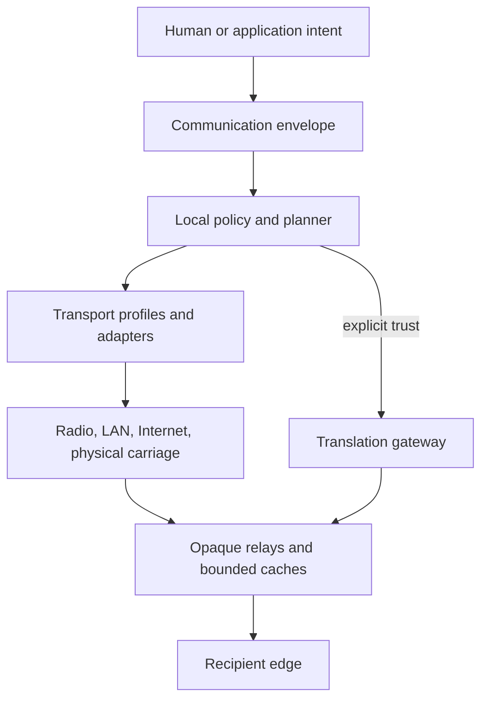

# Architecture

**State:** architecture under design

Groundwave separates a human-intent layer from the mechanisms that carry and transform a message. The core evaluates an end-to-end communication envelope containing sender and recipient capabilities, available paths, latency, bandwidth, energy, storage, trust, delivery probability, deadlines, and representation constraints.

The core owns intent, policy, provenance, transformation authorization, delivery evidence, and adapter contracts. Profiles integrate existing transports. Ordinary relays do not gain plaintext or authority merely because they offer capacity. Gateways that need plaintext or representation access are explicitly trusted for a bounded action.

Delivery controls remain independent: expiration, hop budget, replica budget, priority, deadline, custody, acknowledgment, payload class, minimum acceptable representation, preferred relay, and confidentiality.

Conformance will use schemas, canonical fixtures, policy tests, loss receipts, custody state-machine tests, adapter interoperability, and negative security cases. No conforming implementation exists today. Detailed documents begin at the [architecture index](docs/architecture/overview.md).
