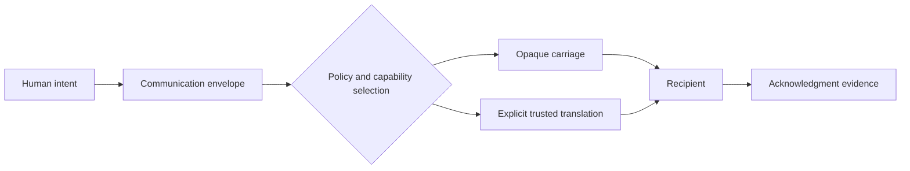

# Groundwave

> **Early-stage adaptive communications platform**
>
> “The underlying medium changes. The human intent persists.”

Groundwave explores how one human can securely reach another across whatever viable devices, paths, transports, relays, caches, and representations are available.

The promise is bounded: Groundwave cannot create connectivity, defeat physics, or guarantee delivery. It aims to make the best responsible use of available connectivity while respecting privacy, owner policy, regulation, energy, storage, bandwidth, and airtime fairness.

## Project state

Groundwave is in architecture and reference-design work. There is no released platform implementation. A separate repository contains an unqualified, pre-prototype FieldNode design. Reticulum, LXMF, and RNode are important integration candidates—not the platform definition.

See the evidence-based [project state](PROJECT_STATE.md), intended [vision](VISION.md), adopted [doctrine](DOCTRINE.md), and [roadmap](ROADMAP.md).

## Stable abstraction

The platform is designed around five questions: who is the recipient, what is being communicated, how urgent is it, what degradation is acceptable, and what acknowledgment is required? The connective layer preserves intent, identity, policy, provenance, and security while carriage may change from live media to audio, images, text, acknowledgments, or a few authenticated bits.

No single protocol, vendor, carrier, cloud, radio, package, or application is mandatory. Ordinary relays forward opaque encrypted payloads whenever possible. Trusted gateways declare transformations and loss. Delivery is bounded; best effort does not authorize flooding or surveillance.

Start at the [documentation index](docs/index.md), [architecture](ARCHITECTURE.md), [threat model](THREAT_MODEL.md), [repository audit](docs/project/repository-audit.md), or [contribution guide](CONTRIBUTING.md).

`Groundwave` remains a provisional legacy working name. A rename is explicitly deferred.
