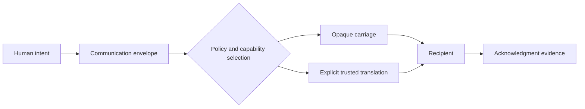

# Harriet

Harriet is named in honor of Harriet Tubman. [Why Harriet](WHY_HARRIET.md) explains the tribute, its limits, and the permanent stewardship obligations created by the name.

> **Early-stage adaptive communications platform**
>
> “The underlying medium changes. The human intent persists.”

Harriet aims to help one human communicate with another across whatever viable devices, paths, transports, relays, caches, and representations are available, using protections declared by each profile.

The promise is bounded: Harriet cannot create connectivity, defeat physics, or guarantee delivery. It aims to make the best responsible use of available connectivity while respecting privacy, owner policy, regulation, energy, storage, bandwidth, and airtime fairness.

## Project state

Harriet is in architecture and reference-design work. There is no released platform implementation. A separate repository contains an unqualified, pre-prototype FieldNode design. Reticulum is the adopted target for the first profile; that profile remains architecture under design and has no conformance claim.

See [why the project is named Harriet](WHY_HARRIET.md), the evidence-based [project state](PROJECT_STATE.md), intended [vision](VISION.md), adopted [doctrine](DOCTRINE.md), and [roadmap](ROADMAP.md).

## Stable abstraction

The platform is designed around five questions: who is the recipient, what is being communicated, how urgent is it, what degradation is acceptable, and what acknowledgment is required? The connective layer preserves intent, identity, policy, provenance, and security while carriage may change from live media to audio, images, text, acknowledgments, or a few authenticated bits.

No single protocol, vendor, carrier, cloud, radio, package, or application is mandatory. Ordinary relays do not require plaintext; any plaintext carriage or access is explicit, visible, policy-authorized, and profile-constrained. Trusted gateways declare transformations and loss. Delivery is bounded; best effort does not authorize flooding or surveillance.

Start at the [documentation index](docs/index.md), [architecture](ARCHITECTURE.md), [threat model](THREAT_MODEL.md), [repository audit](docs/project/repository-audit.md), or [contribution guide](CONTRIBUTING.md).

Harriet is the adopted public name and `HarrietProject/Harriet` is the canonical repository. [RFC 0003](docs/rfc/0003-complete-harriet-identifier-migration.md) records the controlled identifier migration; it does not claim package, domain, trademark, certification, or protocol clearance.
